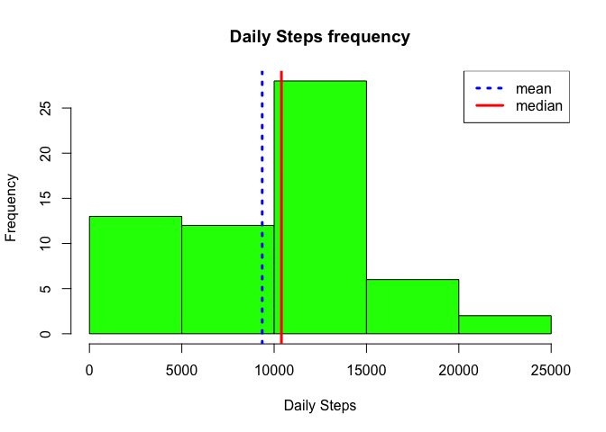
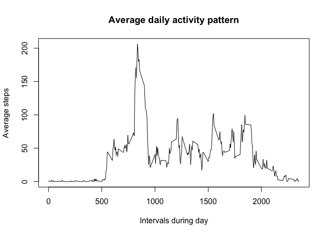
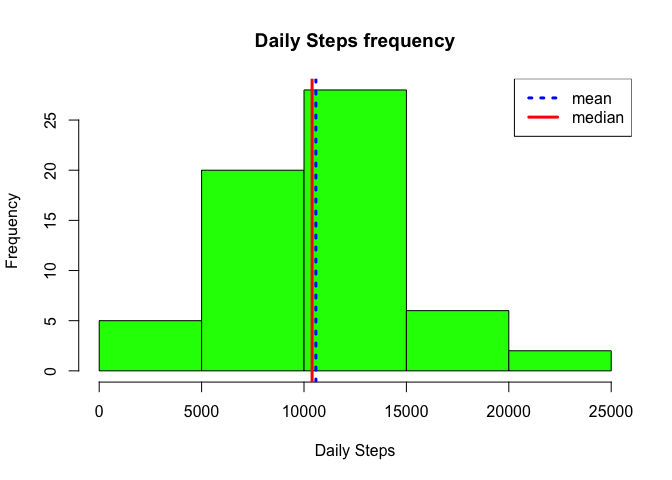
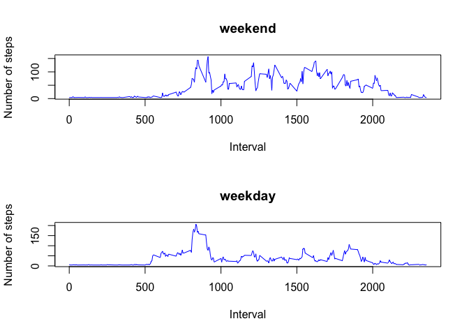

## Loading and preprocessing the data


```r
#Download the data
fileUrl <- "https://d396qusza40orc.cloudfront.net/repdata%2Fdata%2Factivity.zip"
if(!file.exists("RepData1"))
  dir.create("RepData1")
download.file(fileUrl,"RepData1/repdata_activity.zip", method="curl") 

# unzip file

zipFile<- "RepData1/repdata_activity.zip"
outDir<- "RepData1"
unzip(zipFile,exdir=outDir)

library(dplyr)
```

```
## 
## Attaching package: 'dplyr'
```

```
## The following objects are masked from 'package:stats':
## 
##     filter, lag
```

```
## The following objects are masked from 'package:base':
## 
##     intersect, setdiff, setequal, union
```

```r
currPath <- getwd()

# Read  data
activity <- read.csv(file.path(currPath,"RepData1","activity.csv"))
```


## What is mean total number of steps taken per day?

```r
par(mfrow = c(1,1))
totalStepsByDay <- tapply(activity$steps,activity$date,sum,na.rm = TRUE)
hist(totalStepsByDay[1:length(totalStepsByDay)],col = "green",xlab = "Daily Steps",main = "Daily Steps frequency")
abline(v= mean(totalStepsByDay),col ="blue",lwd=3,lty=3)
abline(v= median(totalStepsByDay),col ="red",lwd=3)
legend("topright",c("mean","median"),col = c("blue","red"), lty=c(3,1), lwd =c(3,3))
```

<!-- -->

```r
summary(totalStepsByDay)
```

```
##    Min. 1st Qu.  Median    Mean 3rd Qu.    Max. 
##       0    6778   10395    9354   12811   21194
```


## What is the average daily activity pattern?

```r
par(mfrow = c(1,1))

totalStepsThruDay <- tapply(activity$steps,activity$interval,mean,na.rm = TRUE)

totalStepsThruDayDF <- data.frame(interval=names(totalStepsThruDay),mean=totalStepsThruDay)
totalStepsThruDayDF$interval2 <- as.integer(as.character(totalStepsThruDayDF$interval))
totalStepsThruDayDF <- arrange(totalStepsThruDayDF,interval2)
plot(totalStepsThruDayDF$interval2,totalStepsThruDayDF$mean,type="l",xlab = "Intervals during day",ylab = "Average steps",main = "Average daily activity pattern")
```

<!-- -->

```r
# interval with max number of steps during day
totalStepsThruDayDF[which.max(totalStepsThruDayDF$mean),"interval2"]
```

```
## [1] 835
```

## Imputing missing values

```r
# Number of NA values
sum(is.na(activity$steps))
```

```
## [1] 2304
```

```r
library(Hmisc)
```

```
## Loading required package: lattice
```

```
## Loading required package: survival
```

```
## Loading required package: Formula
```

```
## Loading required package: ggplot2
```

```
## 
## Attaching package: 'Hmisc'
```

```
## The following objects are masked from 'package:dplyr':
## 
##     src, summarize
```

```
## The following objects are masked from 'package:base':
## 
##     format.pval, units
```

```r
par(mfrow = c(1,1))
activityImputed <- activity
activityImputed$steps <- impute(activity$steps, mean(totalStepsByDay)/288)
totalStepsByDayImputed <- tapply(activityImputed$steps,activityImputed$date,sum)
hist(totalStepsByDayImputed[1:length(totalStepsByDayImputed)],col = "green",xlab = "Daily Steps",main = "Daily Steps frequency")
abline(v= mean(totalStepsByDayImputed),col ="blue",lwd=3,lty=3)
abline(v= median(totalStepsByDayImputed),col ="red",lwd=3)
legend("topright",c("mean","median"),col = c("blue","red"), lty=c(3,1), lwd =c(3,3))
```

<!-- -->

```r
summary(totalStepsByDayImputed)
```

```
##    Min. 1st Qu.  Median    Mean 3rd Qu.    Max. 
##      41    9354   10395   10581   12811   21194
```


## Are there differences in activity patterns between weekdays and weekends?

```r
activityImputed$weekDayOrEnd <- factor(ifelse(weekdays(as.Date(as.character(activityImputed$date))) =="Saturday" | weekdays(as.Date(as.character(activityImputed$date))) =="Sunday","Weekend","Weekday"))

#average daily activity pattern
par(mfrow = c(2,1))


activityImputedWeekend <- filter(activityImputed,weekDayOrEnd == "Weekend")
totalStepsThruWeekend <- tapply(activityImputedWeekend$steps,activityImputedWeekend$interval,mean,na.rm = TRUE)

totalStepsThruWeekendDF <- data.frame(interval=names(totalStepsThruWeekend),mean=totalStepsThruWeekend)
totalStepsThruWeekendDF$interval2 <- as.integer(as.character(totalStepsThruWeekendDF$interval))
totalStepsThruWeekendDF <- arrange(totalStepsThruWeekendDF,interval2)
plot(totalStepsThruWeekendDF$interval2,totalStepsThruWeekendDF$mean,col="blue", type="l",xlab = "Interval",ylab = "Number of steps",main = "weekend")

activityImputedWeekDay <- filter(activityImputed,weekDayOrEnd == "Weekday")
totalStepsThruWeekDay <- tapply(activityImputedWeekDay$steps,activityImputedWeekDay$interval,mean,na.rm = TRUE)

totalStepsThruWeekDayDF <- data.frame(interval=names(totalStepsThruWeekDay),mean=totalStepsThruWeekDay)
totalStepsThruWeekDayDF$interval2 <- as.integer(as.character(totalStepsThruWeekDayDF$interval))
totalStepsThruWeekDayDF <- arrange(totalStepsThruWeekDayDF,interval2)
plot(totalStepsThruWeekDayDF$interval2,totalStepsThruWeekDayDF$mean, col="blue",type="l",xlab = "Interval",ylab = "Number of steps",main = "weekday")
```

<!-- -->
